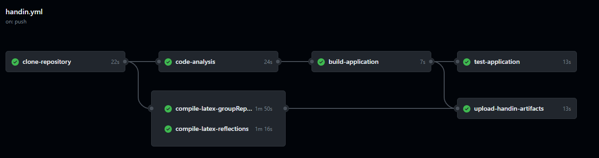

# Advanced Software Architecture and Analysis Portfolio Template
- [Introduction](#introduction)
- [Folder Structure & File Placements](#folder-structure--file-placements)
- [Quick Start](#quick-start)
- [CI/CD Workflow](#cicd-workflow)
- [Hand in Workflow](#hand-in-workflow)
- [Compiling Latex](#compiling-latex)

## Introduction
This repository implements a microservices-based book production system for Advanced Software Engineering portfolio project.

## Folder Structure & File Placements

### Report
Please note that the Group Report in Latex-format is located under the `report/GroupReport/Group4_Book_Production_Report_ASAAT` folder.
Whereas the PDF-Version of the Group Report is located under the `report/GroupReport` folder.

### Src
Please note that the source code for the Group Project is located under the `src` folder.
This folder contains multiple microservices, but the main folder you should be looking at is: `src/UnifiedScheduler`.

### UPPAAL & R-Scripts
Please note that the UPPAAL model xml-file and the R scripts are located under the `src/uppaal_and_r` folder.
It is important to note that test-data for the R-scrips are from the orders.csv file located under the `src/UnifiedScheduler` folder.

## Quick Start

### Prerequisites
- Docker and Docker Compose installed
- Git

### Run the System

1. **Start all services:**
```bash
cd src/UnifiedScheduler
docker-compose up -d
```

This starts:
- MQTT Broker (port 1883)
- Redis (port 6379)
- TimescaleDB (port 5432)
- Unified Scheduler with Web Dashboard (port 8080)
- 4 Machine Simulators (A, B, C, D)

2. **Access the Web Dashboard:**

Open your browser and navigate to:
```
http://localhost:8080
```

From the web dashboard you can:
- **Create new orders** - Specify title, author, pages, cover type, paper type, and quantity
- **Monitor the scheduler in real-time** - Watch jobs being assigned to machines
- **Track order progress** - See which units are in progress and completed
- **View completion status** - Know when your order is complete
- **Analyze statistics** - View processing times and requeue events for each order

The dashboard provides a live view of:
- Active machines and their current status
- Job queue lengths for each stage (A, B, C, D)
- Order progress with unit-by-unit tracking
- Historical statistics including total processing time and requeue counts

## .github
This folder contains template workflows designed for CI/CD processes and for generating the final submission artifacts.

### CI/CD Workflow
The CI/CD workflow is split into several jobs:


- **Clone repository**: Clones the repository, creates an artifact from it, and then uploads this artifact, ensuring consistency across all jobs.
- **Code analysis**: Utilize this job for linting or any other static code analysis tools you'd like to incorporate.
- **Build application**: Compile the source code. After compiling, the artifact is uploaded for easy accessibility, aiding in debugging and local testing.
- **Test application**: Run tests that require the code to be compiled. This step downloads the compiled artifact created in the previous step.
- **Build and push image**: Builds an image using a specified `DockerFile` and pushes the image to the GitHub container registry specific to the repository owner.
- **Deploy application**: Can be used to deploy the image(s) generated during the workflow onto your virtual machines.

### Hand in Workflow
The hand-in workflow includes some of the jobs from the CI/CD workflow and some additional ones:



- **Compile latex groupReport**: This job compiles the latex source files for the group report and upload the output as an artifact.
- **Compile latex groupReport**: This job compiles the latex source files for the reflections document and upload the output as an artifact.
- **Upload hand-in artifacts**: This job creates a zip file containing the Group Report, the Reflections Document, the source code, and any build artifacts. The zip can be downloaded by navigating to Repository > Actions > The completed hand-in workflow as shown in the image below.


## Compiling Latex
You can compile latex source files to PDF locally. Multiple options are available; choose the one you prefer.

### Option 1: LaTeX Workshop Extension + TeX Live
For this option, you'll need the VSCode extension called LaTeX Workshop and the LaTeX Distribution named TeX Live.

While TeX Live does require 6GB! of space, it is a comprehensive collection of nearly all LaTeX packages, it is very user-friendly when paired with LaTeX Workshop.

#### Extension


#### Link to download TeX Live
[TeX Live Official Download](https://www.tug.org/texlive/)

### Option 2: Trigger Task on Save Extension + Docker
This option requires Docker to be installed and running.

Here's how it works:

Inside the `report` directory, there's a docker-compose-latex.yml file.

- This docker-compose file will create bind volumes for the `GroupTemplate` and `ReflectionsTemplate` folders.
- A docker container will start, compile the latex source files, and then exit. The initial process might be a little time-consuming as it needs to create the image. However, afterwards compilations are faster.

To manually run the docker-compose-latex.yml and compile both latex documents, use the command:

- ```docker compose -f report/docker-compose-latex.yml up```

To only compile a specific latex document i.e `GroupReport` or `Reflections` use these commands:

- ```docker compose -f report/docker-compose-latex.yml run latex reflection```
- ```docker compose -f report/docker-compose-latex.yml run latex groupreport```

#### Trigger Task on Save Extension
If you're using VSCode, you can set up your latex files to compile upon saving.
For this, download the `Trigger Task on Save` extension.


This extension will trigger tasks defined in `.vscode/tasks.json` every time you save a `.tex` file.
The task will execute the `docker compose -f report/docker-compose-latex.yml run latex` command with a parameter, depending on the .tex file you are working on.

### Option 3: Overleaf
You are free to import the latex source files into Overleaf.
- If you use this method, you could export the source files from overleaf when done with the report and reflections document.
- By placing the source files into their respective folders `repot/GroupTemplate` and `report/ReflectionsTemplate` you can still take advantage of the handin workflow when creating your final hand in artifact.

## Recommended VSCode Extension

### GitHub Actions

- GitHub workflow documentation
- Auto completion
- Overview of workflow runs directly from VSCode


